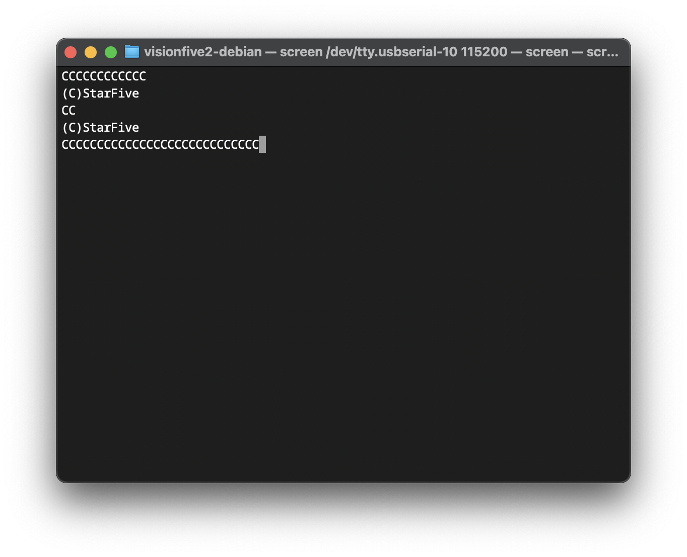

>[!NOTE]
> 后来 Ubuntu 官方提供了[适配于 VisionFive 2 的安装映像](https://ubuntu.com/download/risc-v)，但似乎对于早期用户来说需要进行固件更新。
>
> 至少我没有尝试启动成功（恼

[VisionFive 2（昉·星光 2）](https://doc.rvspace.org/Doc_Center/visionfive_2.html) 是一款来自 StarFive 的 RISC-V SBC，搭载了一颗 JH7110 SoC (4x 1.5GHz)。当时看中这张板子的一个重要原因是...双千兆网口和板子背面自带 M.2 插槽，比较适合拿来跑一些和网络相关的任务，比如说软路由和 NAS 之类的（希望性能足够）。值得一提的是尽管同价位的双网口机器不少，而且似乎它们的性能大部分都可以说是可以把 JH7110 按在地板上摩擦，但是 riscv64 的仅此一家（至少当时是这个样子的），更别提还可以插 SATA 转接卡的了（写这篇文章的时候发现官方支持通过 M.2 接口外接 Hailo-8L NPU，边缘计算能力++）。为了探索 linux riscv64 生态，我就搞了一张 8GB 的版本，看看传说中战未来的开源指令集生态在当下的实际使用体验是怎么样的。

StarFive [官方提供了 debian 的映像](https://debian.starfivetech.com/)，但是似乎预装了许多我不需要的东西，比如说 `gnome` 之类的，而且内核的版本 `Linux 5.5` 和 `Linux 6.6` （在同个镜像文件内，启动时可选择内核） 相对较老，似乎没能达到我想尝试的功能的版本要求，同时，经过长时间的发展大部分 JH7110 驱动也已经被合并进了内核主线[^1]，所以综合考虑之下从头开始制作一个映像成为了一个不错的选择。关于自定义映像的更多内容可以在查看 [StarFive 官方文档](https://rvspace.org/en/project/Building_StarFive_Debian_Image)，这篇文章也几乎是对此教程的复现。

[^1]: 主线内核状态：[https://rvspace.org/en/project/JH7110_Upstream_Plan]

不过我在刚拿到板子的时候，做了非常多奇怪怪的事情，（也许）导致一不小心将自己的 8GB 版本刷成了 4GB 的固件（？），导致了进入 Linux 之后发现自己 RAM 只剩下了 4GB。所以，为了保险起见，在一切开始之前，我们需要先...

>[!NOTE]
> 在后续查资料的过程中，发现[有人在论坛上反馈](https://forum.rvspace.org/t/debian-12-build-recognized-only-4gb-of-ram-from-8gb-installed-on-device/4511)出现了类似的现象，这可能是 StarFive 官方提供的 debian 映像提供了错误的 dtb 文件之类的，GitHub 上有人提出了[可能的修复方法](https://github.com/starfive-tech/VisionFive2/issues/20#issuecomment-1374907916)。

## 重置/更新 Bootloader

参考[官方文档 4.3](https://doc.rvspace.org/VisionFive2/PDF/VisionFive2_QSG.pdf)

### 准备工作

1. 在开始之前，先确保你所需要的的软件包都有被正确安装，同时创建一个工作目录用来存放所需要的所有文件

    ```zsh
    # macOS
    brew install screen lrzsz

    # debian / Ubuntu
    apt install screen lrzsz

    mkdir visionfive2-debian && cd "$_" && mkdir bootloader
    ```

2. 从 [github://starfive-tech/Tools](https://github.com/starfive-tech/Tools/tree/master/recovery) 下载最细版本的恢复固件，比如说我这里是 `jh7110-recovery-20230322.bin`：

    ```zsh
    wget https://raw.githubusercontent.com/starfive-tech/Tools/refs/heads/master/recovery/jh7110-recovery-20230322.bin -O ./bootloader/recovery.bin
    ```

3. 从 [github://starfive-tech/VisionFive2/releases](https://github.com/starfive-tech/VisionFive2/releases) 下载最新的 VisionFive 2 固件（`u-boot-spl.bin.normal.out` 和 `visionfive2_fw_payload.img`），以 `v5.14.1` 为例：

    ```zsh
    wget https://github.com/starfive-tech/VisionFive2/releases/download/JH7110_VF2_515_v5.14.1/u-boot-spl.bin.normal.out -O ./bootloader/u-boot-spl.bin.normal.out
    wget https://github.com/starfive-tech/VisionFive2/releases/download/JH7110_VF2_515_v5.14.1/visionfive2_fw_payload.img -O ./bootloader/visionfive2_fw_payload.img
    ```

至此，准备结束。

### 传输并刷写（世界线 A）

1. 使用串口连接 VisionFive 2，具体的硬件文档可以在官方的文档中找到，同时将启动跳线调至 `UART` 模式（参考文档 4.5）(GPIO_1: 1，RGPIO_0：1)。

2. 使用最喜欢的串口工具连接上开发板，波特率 115200:

    ```zsh
    screen /dev/tty.usbserial-10 115200
    ```

    此时你应该可以看到输出形如：
    

3. 使用 xmodem 客户端上传 `recovery.bin`，若失败跳转 [世界线 B](#传输并刷写世界线-b)
4. 按照 cli 指引（0）上传 `u-boot-spl.bin.normal.out`
5. 按照 cli 指引（2）上传 `visionfive2_fw_payload.img`
6. 更新完成，关闭电源，并将跳线调回 Flash 模式 (GPIO_1: 0，RGPIO_0：0)

### 传输并刷写（世界线 B）

以上是 StarFive 的官方文档提供的刷写步骤，但是很遗憾，并没有在我的板子上成功复现，在进行 xmodem 文件传输的时候一直失败了，所以我这里采用了另一种方法: `flashcp`（前置要求：可以正常进入预先提供的系统）。

参考[官方文档](https://doc-en.rvspace.org/VisionFive2/Quick_Start_Guide/VisionFive2_SDK_QSG/spl_new.html#updating_spl_and_u_boot-vf2__section_zpj_cqt_yvb)

1. 引导进入 debian，安装必要的软件包 `mtd-utils`

    ```bash
    sudo apt update

    sudo apt install mtd-utils
    ```

    安装完后检查 `flashcp` 的存在，如果不在，可以尝试查看 `/usr/sbin`，根据我的观察似乎官方映像内这个目录并没有加在 `PATH` 里面，所以可能需要手动添加一下。

    ```bash
    echo "export PATH=/usr/sbin:$PATH" >> ~/.bashrc
    
    source ~/.bashrc
    ```

2. 将工作机上的 `u-boot-spl.bin.normal.out` 和 `visionfive2_fw_payload.img` 拷贝到 VisionFive 2 上面，这里我选择了 `scp`
3. 使用 `flashcp` 刷写闪存

   ```bash
   # update SPL
   flashcp -v u-boot-spl.bin.normal.out /dev/mtd0
   
   # update U-Boot
   flashcp -v visionfive2_fw_payload.img  /dev/mtd1
   ```

4. 重启 VisionFive 2 以应用更新

至此，固件更新完成。<待续>

> [!NOTE]
> 为了不在奇怪的地方出问题，我在这里把工作挪进了 Linux 虚拟机。不过似乎出现了一个衍生需求：由于 `multipass` 暂时不支持将 USB 设备挂载进虚拟机里，而我们可能需要在虚拟机里通过串口访问 VisionFive 2。
> 
> 其中一种解决方案是通过网络的方法访问串口，比如说[`ser2net`](https://github.com/cminyard/ser2net)，一个现有的开源解决方案。不过由于个人感觉操作过于复杂，所以写了一个类似的小玩具 [`ston`](https://github.com/Lumither/ston)，aka `Serial TTY Over Network` [^2]，相比之下不用搓配置文件，直接传参即可，虽然还有很多小问题（当然，也许还有大大的安全问题），不过欢迎前来玩耍wwww。
>
> 至于后面想了一圈发现可以直接 ssh 那就是后话了（（

[^2]:
    原本是想叫 `s2n` 的，不过 Homebrew 中 aws 的 `s2n-tls` 包名不知道为什么是 `s2n`，明明其他 Linux 发行版都是照搬原名的（碎碎念）

## 映像基础结构

给单板机算计刷系统什么的好像没什么好说的，只要从发行版官网吧映像下载下来，然后随便丢进类似 `balenaEtcher` 这样的软件里直接刷写介质，然后就可以插入板子愉快开机了，就像平时使用树莓派那样就可以了...吗？似乎不是这样的，刚开始我也是按照所谓俺寻思操作逻辑做的，然后就发现 debian 官方好像就没有没有给出 RISC-V 版本的映像。

<待续>
